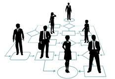

The urgency that athletic software engineering entails, in my experience so far, “works out” two skills that I believe to be critical in average productivity when writing code.  First, it requires accurate parsing of a task into its core pieces to reach “flowcharts” or “waypoints” to build end-goal functionality.  Professionally and academically, whether coding alone or in a group, or especially when in a meeting, the ability to “not shy away” from a daunting task, and to rather quickly think through and/or discuss specific, attainable steps toward solving it can make one a much more valuable team member.

Second, it helps to fine-tune the budgeting of time allocated toward planning vs. implementation.  When a WOD’s time limit may only allow for one full attempt at implementation, you’ll want to be quite confident in your plan before spending much time typing.  Even in the absence of a time crunch, it can be tempting to “dive straight in” to implementation, but I’ve found that thinking through a full plan (not necessarily detailed but complete in functionality) before starting much implementation saves much time on average.
