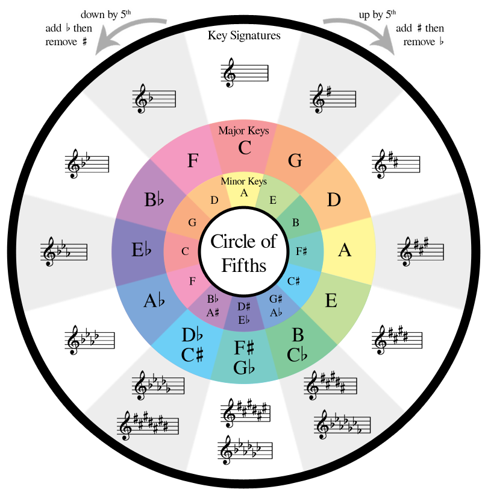

 

Two comparisons jump to mind when considering design patterns: music theory and storytelling templates. Both are forms found in quality work, whether or not followed consciously, and they are indeed optional but recommended. Throughout time, pioneers and/or veterans of their fields identified commonalities in quality, described those themes, and shared them, so that others of lesser experience could make the most of their trials and triumphs.

In the early stages of music, people just made sounds they liked. And of course, such is still often the end goal, but the guidance of music theory, and more casually, musical genres, guide the modern songwriting process. Music is such an emotional endeavor, however, that people often obey the laws of musical theories and fit genres without realizing it. A lover of reggae music may instinctively put emphasis on the upbeats of songs, knowing simply that it sounds good.

Pictured above to the left is the famous circle of fifths - an idea in music theory that allows those writing or even learning songs to accurately choose notes that will sound good in combination with what they’re playing. Without this, you can still quite feasibly create good music, but knowledge of this form may turn a six-hour composing session into a two-hour one in which you have a better end result.

Storytellers and writers throughout history have, similarly to musicians, simply told stories they think people will want to hear, whether toward entertainment, insight, etc. And over time, the archetypes of these stories, formed into templates wherein character archetypes exist, have become clear, perhaps the most famous of which is the hero’s journey, pictured above and to the right.  This form is so common, in fact, that many people follow it very closely without any idea of its formal definition.  Most of mine and my friends’ short stories for school or for fun followed this template to a tee, only to our later revelatory discovery.

Design patterns take on a similar role for programmers – if you’re keen to quality, you may achieve the form without knowing it.  But even for experts, a little guidance can save a lot of grief and expand one’s bottom-line potential.

Finally, the widespread use of these forms shouldn’t confine one’s thinking to the paradigm – quality is still the end goal; guiding forms are a facilitator, not the boundary.

I've worked with the MVC design pattern in iOS programming, during which I've also worked with the Singleton design, also in programming projects at UH such as the Manoa Pizza Bakery from ICS 211.  Now knowing the formal definitions of the common design patterns their benefits when consciously sought out, I will look to use them to “stand on the shoulders of giants” when I can.

