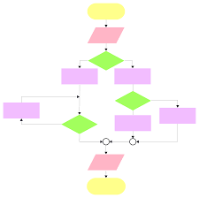

# Academic Path & Progress Visualizer

Note: I imagine this has been thought of before, but I’ll outline the idea below in case it has any unique elements:

## Overview (including “The problem” and “The solution”)

#### The problem
Though some UH degree plans provide a static flowchart, [such as these for the Bachelor's in ICS tracks](https://www.ics.hawaii.edu/academics/undergraduate-degree-programs/bs-ics/), an interactive visualizer of your path / timing and progress for your current degree plan could be a nice visual accompaniment to STAR’s Academic Essentials tab.

#### The solution
A separate browser tab openable when logged in to one's STAR account will populate a semester-separted flowchart with color-coding / shading for progress and a click-and-drag interface so students can visually experiment with the timings and intra-semester combinations of their degree's remainig requirements.  

Dependencies / prerequisites will be indicated with arrows (wherein prerequisites cannot be dragged into the same semester with their prerequisites) and an "enrollment override" checkbox if applicable.

## Mockup page ideas
Major requirements will be shown in the middle of the screen, and general requirements will be shown at the top.  Degree plans will be selectable from a dropdown menu.  Ideally, this would support double majors, but v1 would support single majors.

Semester credit hour totals as well as total credits remaining would be visible

Note: the page would need several caveats, such as the last date the system was updated for a specific degree plan, the fact that not every class is available every semester, that seat availability is limited, etc.

## Use case ideas
- User is considering switching tracks and wants to see how their current progress stacks up with another degree plan / how the other track affects their timing and remanining required hours.
- User wants to optimize their path to graduation through remaining required time and/or 

## Beyond the basics
- Support for departments beyond ICS
- Support for double majors
- Indication of available courses to satisfy general eduction requirements (requires direct interaction with STAR database)
- Very difficult: interaction with STAR's actual enrollment system (though this would presumably involve too many variables and permissions, maintenance, etc. to be feasible in the scope of this project).
