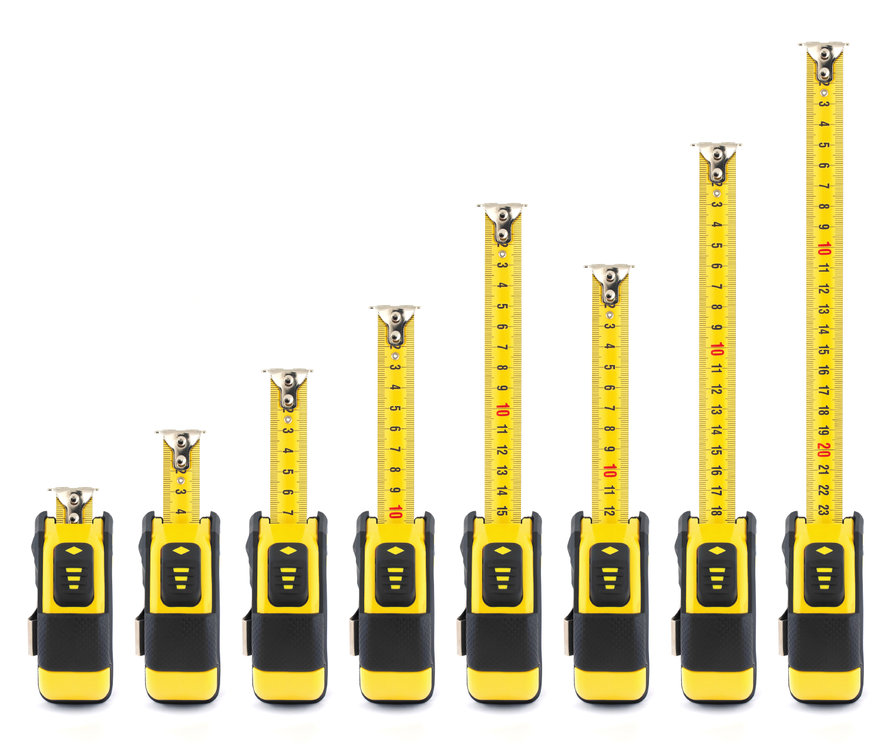

## Adage Adjusted

A recurrent theme, which ICS 314 proved to me most directly, is that––before any code––planning exhaustively within your current scope, then repeating as things change, though seemingly overly-cautious, saves time.

The adage "measure twice, cut once" echoes into many things; however, in software engineering, I would rephrase it as "measure once, but far and often."  As tools in computer science are very discrete, unlike spectra such as length, a single measurement for each task will suffice1.  Yet, assessing in detail several ahead steps ahead coupled with open-mindedness to again consider alternatives in light of new information is the true time saver.

Throughout planning, certain things may fall outside of your scope of knowledge, and coding through simple examples to answer your questions is optimal.

Functional programming further illustrated to me the power of a "wide scope of measurement," as chaining functions together in a well-thought-out sequence can circumvent temporary storage, entire classes, and can even provide expand bottom-line capabilities.

My essay "The Safe, Semi-Motorized Ornithopter" outlines this idea in relation to UI Frameworks, but I've found it to be ubiquitous in software engineering.

## Redirecting Instinct

As creatures that like to have things addressed and done, our common (and often helpful) impulse is simply to start and adjust as we go.  For tasks with small implementation variance, such as chores, this is all we need.  And for something like software engineering, wherein just how much you've done is easily measurable, our instinct to get that "progress bar" filling as soon as possible is strong.

However, through several unfortunately backtracked and rehashed implementation endeavours, the disheartening process of deleting blocks upon blocks of code has ingrained in me that cutting corners often requires you to run part of all of the race over.

Rather than block out this instinct, however, I suggest re-framing what that impulse prompts- that is, planning, though absent from executables, is empirical, measurable progress.  Allowing your mind to more accurately focus that "go-to" mindset can utilize the best of both worlds.

1 One might contend that "measuring twice" is more about correctness of procedure than analog accuracy, but "measuring far" in software engineering entails also considering alternatives- in effect, double-checking that your procedure is efficient.