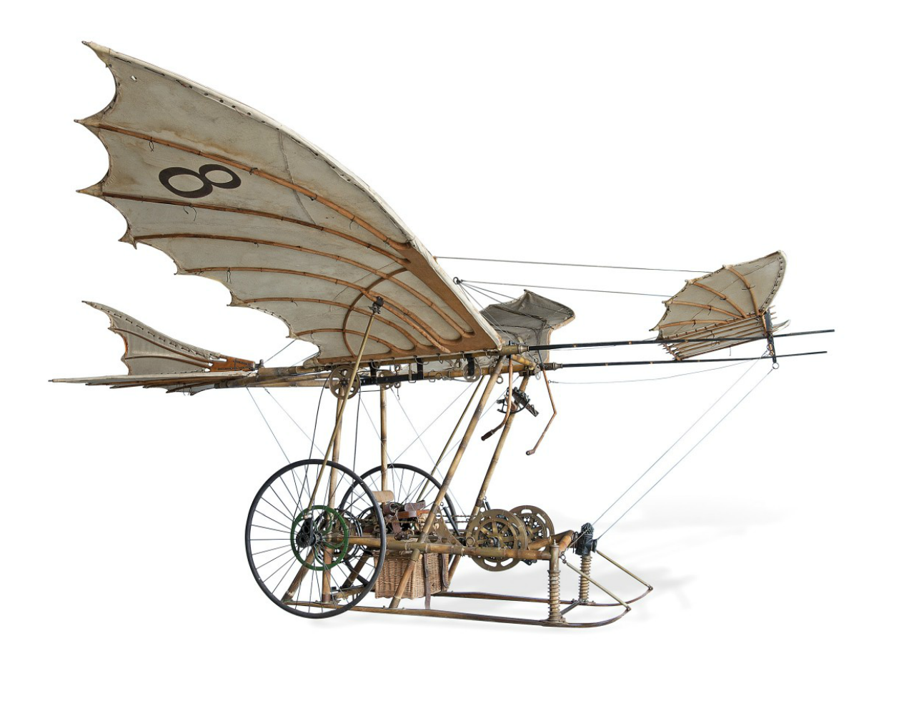

Learning a new framework instead of diving straight into a project using already-familiar tools can seem like an unworthy undertaking, especially when internal and/or external forces just want to "see paint on the wall" quickly for tangible reassurance of a project's progress.

However, having mild experience with the benefits of UI frameworks, I'd like to make an analogy to describe their value.

In this analogy, let the difficulty of your required checkpoint / commit / deployment, be a certain altitude along a hill.  
